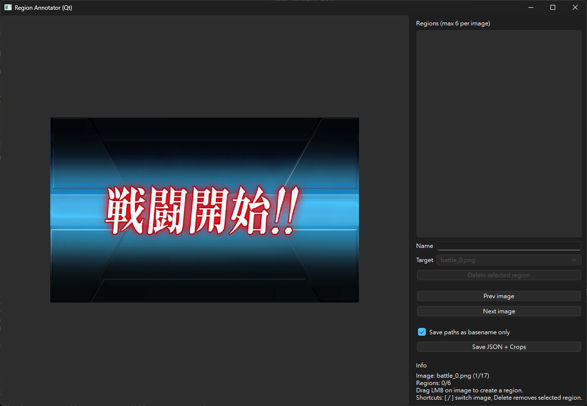
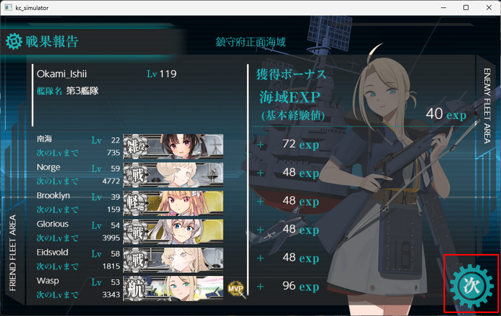

# KC Agent - Feature Matching and Automation Tools

This project provides a suite of tools for feature matching, window automation, and GUI interaction using computer vision techniques.

## Table of Contents

- [Project Overview](#project-overview)
- [Installation](#installation)
- [Project Structure](#project-structure)
  - [kc_simulator](#kc_simulator)
    - [flow_setting.py](#flow_settingpy)
    - [kc_simulator.py](#kc_simulatorpy)
  - [key_identify](#key_identify)
    - [idc_find_feature.py](#idc_find_featurepy)
  - [apply_action](#apply_action)
    - [act_mouse_movement.py](#act_mouse_movementpy)
  - [utility](#utility)
    - [logger.py](#loggerpy)


## Project Overview

The KC Agent project consists of several Python scripts that work together to:
- Find and match visual features in windows using computer vision
- Automate mouse movements and clicks
- Create and manage GUI workflows
- Simulate application interfaces for testing

## Installation

### Prerequisites

- Python 3.12
- Currently test on Windows OS
- Virtual environment recommended

### Dependencies

```bash
pip install opencv-python
pip install numpy
pip install mss
pip install pywin32
pip install pyside6
pip install pathlib
```

### Setup

TODO: under maintenance

## Project Structure

### kc_simulator

This folder stores the simulator for testing and development purposes.

#### flow_setting.py

This file contains the configuration for the simulator workflow. You can test the state transition flow by running:

```
python flow_setting.py --screenshots screenshots
```
where `screenshots` is the path to the screenshots folder. The program will output regions_map.json file that contains the configuration for the simulator workflow.

---

#### kc_simulator.py

Main simulator script that loads the workflow configuration and simulates the kancolle game interface. This tool take the `regions_map.json` as input and load the sceen and button regions to simulate the game interface.
Run the simulator by executing:

```
python kc_simulator.py --config regions_map.json
```

---

### key_identify

#### idc_find_feature.py

Find the template image in the window screenshot using computer vision techniques.
Return MatchResult object with target button coordinates and mata data for the matching result.

##### Usage

```python
# Programmatic usage
from idc_find_feature import FeatureMatcher

matcher = FeatureMatcher("Window Title", "path/to/template.png")
result = matcher.match_template_ORB(min_matches=20, ratio=0.75)
# or
result = matcher.match_template_tm(threshold=0.8)

if result.found:
    print(f"Found at screen coordinates: {result.bbox_screen_xywh}")
    matcher.visualize_match(result)
```

```bash
# Direct execution (uses hardcoded values)
python idc_find_feature.py
```

---

#### act_mouse_movement.py

Utility for moving mouse cursor to target position and performing human-like movements on screen.

##### Usage

```python
from act_mouse_movement import move_mouse_to_rect

# Move to center of rectangle (x, y, width, height)
move_mouse_to_rect((100, 200, 300, 400))

# Move with overshoot (deviation angle: 10°, overshoot distance: 20%)
move_mouse_to_rect((-162,538,132,113), angle_variation_degrees=10.0, overshoot_percentage=20.0)
```

```bash
# Direct execution (uses hardcoded coordinates)
python act_mouse_movement.py
```

---
### utility

Helper functions for the project and scene config files.

#### logger.py

Centralized logging configuration for all scripts in the project.
